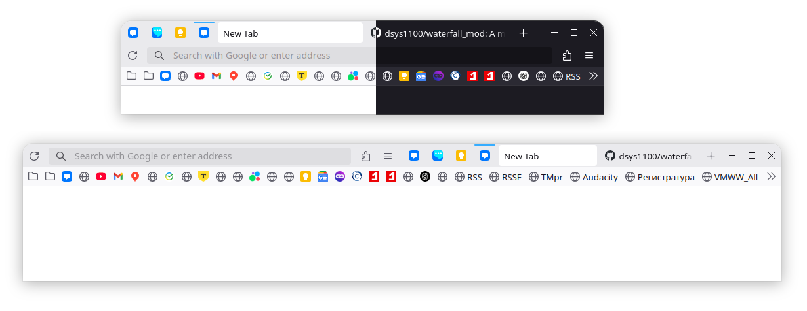

# Waterfall Mod


Original screenshot:


## Description
Waterfall is a fork² of the beautiful [Cascade](https://github.com/andreasgrafen/cascade) custom CSS theme for firefox by [Andreas Grafen](https://andreas.grafen.info). The goal is to make a mouse-centered cascade custom CSS theme.

what this theme brings back :
- window control buttons
- back button
- close tab button on hover
- hamburger menu

## Themes


Waterfall fork support any default themes.

## Installation

- In the ```about:config``` page on your Firefox browser, set the following parameters to **True** :
  - ```toolkit.legacyUserProfileCustomizations.stylesheets```
- Copy the userChrome.css file from this repository to your **chrome** folder. You can find the **chrome** folder here :
  - On Linux : ```$HOME/.mozilla/firefox/######.default-release/chrome/```
  - On Windows : ```C:\Users\[USERNAME]\AppData\Roaming\Mozilla\Firefox\Profiles\######.default-release\chrome\```
  - On MacOS : ```Users/[USERNAME]/Library/Application Support/Firefox/Profiles/######.default-release/chrome```
  - If it doesn't exist already create a folder called chrome

## Authors:

- Andreas Grafen (original cascade theme) (https://andreas.grafen.info)
- Clément Rambaud (mods on the original file for a mouse-centered use)
- dsys1100 (mod of Waterfall)
‎
## License

See [LICENSE](LICENSE).